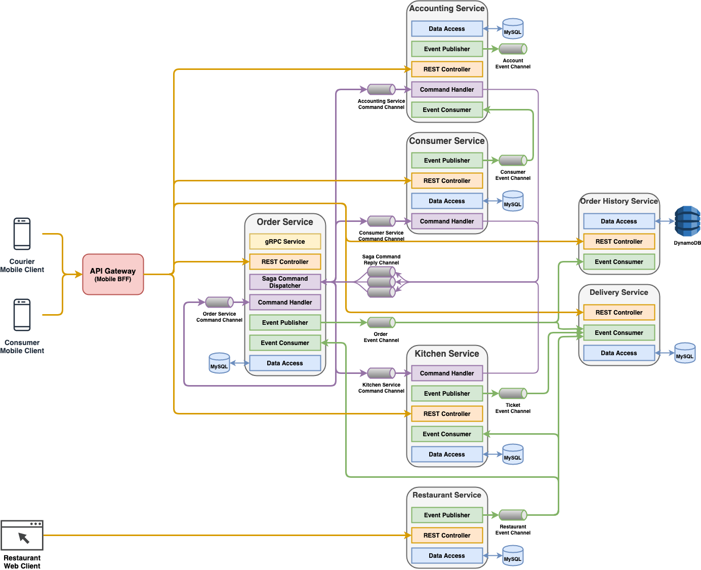

# Architecture

## Services
| Official Name | Directory Name | Application Name | Host | Port |
|---|---|---|---|---|
| [Accounting Service](services/accounting_service.md) | ftgo-accounting-service | ftgo-accounting-service | localhost | 8081 |
| [Consumer Service](services/consumer_service.md) | ftgo-consumer-service | ftgo-consumer-service | localhost | 8082 |
| [Delivery Service](services/delivery_service.md) | ftgo-delivery-service | ftgo-delivery-service | localhost | 8083 |
| [Kitchen Service(services/kitchen_service.md) | ftgo-kitchen-service | ftgo-kitchen-service | localhost | 8084 |
| [Order History Service](services/order_history_service.md) | ftgo-order-history-service | ftgo-order-history-service | localhost | 8085 |
| [Order Service](services/order_service.md) | ftgo-order-service | ftgo-order-service | localhost | 8086 |
| [Restaurant Service](services/restaurant_service.md) | ftgo-restaurant-service | ftgo-restaurant-service | localhost | 8087 |

## API Gateway
| Official Name | Directory Name | Application Name | Host | Port |
|---|---|---|---|---|
| [API Gateway](services/api_gateway.md) | ftgo-api-gateway | ftgo-api-gateway | localhost | 8080 |

## CDC Service
| Official Name | Directory Name | Application Name | Host | Port |
|---|---|---|---|---|
| [Eventuate CDC Service](services/eventuate_cdc_service.md) | eventuate-cdc-service | eventuate-cdc-service | localhost | 8090 |

## Message Queue
| Application | Host | Port | Version |
|---|---|---|---|
| Apache ZooKeeper | localhost | 2181 | 3.4.14 |
| Apache Kafka | localhost | 9092 | 2.2.0 |

### Topic
| Topic Name | Message Type | Producer | Consumer | Description |
|----|----|----|----|----|
| accountingService | Command | <li>Order Service | Accounting Service | Accounting Service's incoming command channel. |
| consumerService | Command | <li>Order Service | Consumer Service | Consumer Service's incoming command channel. |
| kitchenService | Command | <li>Order Service | Kitchen Service | Kitchen Service's incoming command channel. |
| orderService | Command | <li>Order Service | Order Service | Order Service's incoming command channel. |
| com.ftgo.accountingservice.model.Account | Event | Accounting Service | | Account aggregate's event channel. |
| com.ftgo.consumerservice.model.Consumer | Event | Consumer Service | <li>Accounting Service | Consumer aggregate's event channel. |
| com.ftgo.orderservice.model.Order | Event | Order Service | <li>Delivery Service<li>Order History Service | Order aggregate's event channel. |
| com.ftgo.restaurantservice.model.Restaurant | Event | Restaurant Service | <li>Order Service<li>Kitchen Service<li>Delivery Service | Restaurant aggregate's event channel. |
| com.ftgo.kitchenservice.model.Ticket | Event | Kitchen Service | <li>Delivery Service | Ticket aggregate's event channel. |
| com.ftgo.orderservice.saga.createorder.CreateOrderSaga-reply | Reply | <li>Order Service<li>Consumer Service<li>Kitchen Service<li>Accounting Service | Order Service | The channel for getting replies for the create order saga. |
| com.ftgo.orderservice.saga.cancelorder.CancelOrderSaga-reply | Reply | <li>Order Service<li>Kitchen Service<li>Accounting Service | Order Service | The channel for getting replies for the cancel order saga. |
| com.ftgo.orderservice.saga.reviseorder.ReviseOrderSaga-reply | Reply | <li>Order Service<li>Kitchen Service<li>Accounting Service | Order Service | The channel for getting replies for the revise order saga. |

