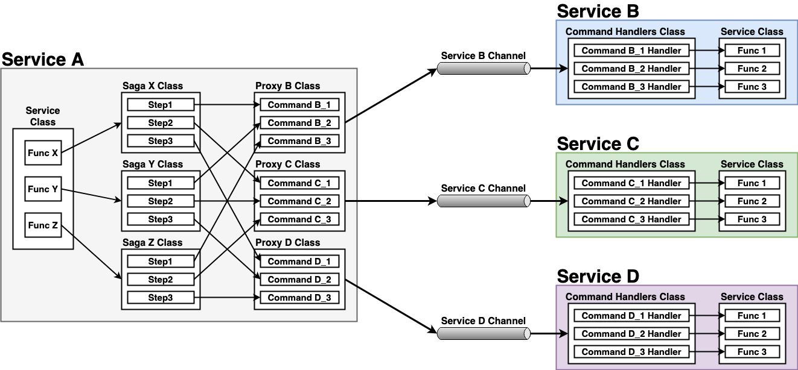
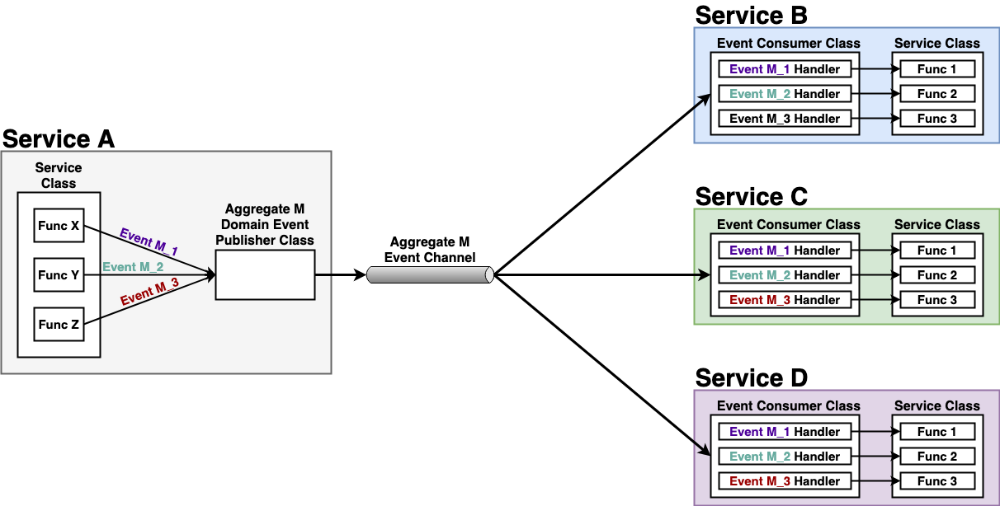

# Code Orgnization for Interservice Communication

- [**Command**](#command)
- [**Event**](#event)

## Command

### Logic
- Each command channel belongs to a specific service for all the incoming command to that service (each command channel has only one consumer).
- Multiple services uses their proxy class to send command messages to a specific command channel (each command channel has one or more producer).

### Core Classes
| Class | Description | Example |
|----|----|----|
| **Service** | Defines the core operations for the service. | <li>[OrderService](../ftgo-order-service/src/main/java/com/ftgo/orderservice/service/OrderService.java) |
| **Saga** | Defines the Saga process for a specific operation. <ul><li>Each Saga process consists of multiples steps (step = state).<li>Each step consists of a command and the info of which service to execute that command.</ul> | <li>[CreateOrderSaga](../ftgo-order-service/src/main/java/com/ftgo/orderservice/saga/createorder/CreateOrderSaga.java) |
| **Proxy** | Defines the command endpoints for connecting a service-specific channel and sending the commands to a specific service. | <li>[KitchenServiceProxy](../ftgo-order-service/src/main/java/com/ftgo/orderservice/saga/proxy/KitchenServiceProxy.java) |
| **Commands Handler** | Defines how to handle each command. <ul><li>Defines mapping relationship between the commands and the command handlers.<li>Each command handler defines the operations need to be executed after receiving a specific command.</ul> | <li>[OrderServiceCommandHandlers](../ftgo-order-service/src/main/java/com/ftgo/orderservice/command/OrderServiceCommandHandlers.java) |

## Event

### Logic
- Aggregate means the core entity of a specific service, like Order entity for the order service, Ticket entity for the kitchen service.
- One aggregate has one or more events belongs to the aggregate, like TicketCreatedEvent and TicketAcceptedEvent belong to Ticket aggregate.
- Each event channel belongs to a specific aggregate (each event channel has only one producer).
- Multiple services may listen to one event channel for the same event (each event channel has one ore more consumer).

### Core Classes
| Class | Description | Example |
|----|----|----|
| **Service** | Defines the core operations for the service. | <li>[KitchenService](../ftgo-kitchen-service/src/main/java/com/ftgo/kitchenservice/service/KitchenService.java) |
| **Domain Event Publisher** | Publish all the events belongs to a specific aggregate. | <li>[TicketDomainEventPublisher](../ftgo-kitchen-service/src/main/java/com/ftgo/kitchenservice/event/TicketDomainEventPublisher.java)
| **Event Consumer** | Defines how to handle each event for a specific aggregate. <ul><li>Defines mapping relationship between the events and the event handlers.<li>Each event handler defines the operations need to be executed after getting a specific event.</ul> | <li>[KitchenServiceEventConsumer](../ftgo-kitchen-service/src/main/java/com/ftgo/kitchenservice/event/KitchenServiceEventConsumer.java)
