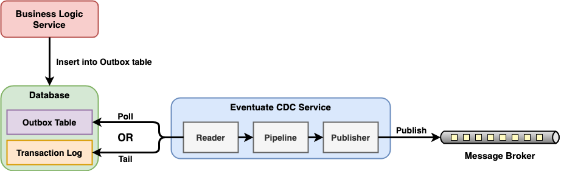

# Eventuate CDC Service

- [**Overview**](#overview)
   - [Concepts](#concepts)
   - [Components](#components)
   - [Modes](#modes)
- [**Configure The CDC Service**](#configure-the-cdc-service)
   - [Configure Reader](#configure-reader)
   - [Common Configuration Properties](#common-configuration-properties)
      - [Core Service Properties](#core-service-properties)
      - [Tailing MySQL Binlog Properties](#tailing-mysql-binlog-properties)
      - [Polling from the Outbox Table Properties](#polling-from-the-outbox-table-properties)
      - [Publishing to Apache Kafka Properties](#publishing-to-apache-kafka-properties)
      - [Publishing to Apache ActiveMQ Properties](#publishing-to-apache-activemq-properties)
      - [Publishing to RabbitMQ Properties](#publishing-to-rabbitmq-properties)
      - [Publishing to Redis Properties](#publishing-to-redis-properties)
- [**Run The CDC Service**](#run-the-cdc-service)
   - [Run by Java JAR File](#run-by-java-jar-file)
   - [Run by Docker Image](#run-by-docker-image)
- [**Specification**](#specification)
   - [Supported Databases](#supported-databases)
   - [Supported Message Brokers](#supported-message-brokers)
- [**References**](#references)

## Overview
### Concepts

- Business logic services use Eventuate Tram libary to insert message/events into the transactional outbox table.
- The Eventuate CDC service reads those messages/events from the transactional outbox table and publish them to the message broker.

### Components
There are 3 components in the Eventuate CDC service:
- **Reader**: Reads the message/event records from the database by either tailing the transaction log or polling the transactional outbox table.
- **Pipeline**: Transforms the message/event records into the JSON messages which can be published to a message broker.
- **Publisher**: Publishes the JSON messages to the message brocker.

### Modes
The Eventuate CDC service can be run in one of those 2 modes:
- **Eventuate Local**
- **Eventuate Tram**

There are the differences between those 2 modes
| Mode | Polling The Transactional Outbox Table | Supported Message Brokers |
|----|----|----|
| **Eventuate Local** | <li>Reads the EVENT table.<li>The aggregate type of the event determines which channel that event will be published to. | Only Apache Kafka. |
| **Eventuate Tram** | <li>Reads the MESSAGE table.<li>The DESTINATION column in the MESSAGES table determines which channel each message will be published to. | All the supported message brokers. |

## Configure The CDC Service
### Configure Reader
There are 2 ways to read the message/event records from the database:
- **Tailing the transaction log**
   - Available for: MySQL and Postgres databases.
   - Mechanism:
      - MySQL: By MySQL Binlog (Binary Log).
      - Postgres: By Postgres WAL (Write-Ahead Logging).
   - MySQL Binlog is disable by default (You have to enable it by changing the `my.cnf` file and restarting the MySQL server)
   - When using this way, the offset of the log file must be stored, there are 2 places to store the offset:
      - Apache Kafka topic: When using Apache Kafka as message broker.
      - Database table: When using a message broker other than Apache Kafka.
- **Polling the transactional outbox table**
   - Available for: All the supported databases.
   - Mechanism: 
      - Polls the transactional outbox table by periodically executing a SQL SELECT statement to retrieve unpublished message/event records.
   - Different modes will read the transactional outbox table:
      - Eventuate Local: Reads the EVENTS table by default.
      - Eventuate Tram: Reads the MESSAGES table by default.

### Common Configuration Properties
#### Core Service Properties
| Property | Description | Default Value | Available Values | Notes |
|----|----|----|----|----|
| `eventuate.cdc.type` | Specify which mode will be run for Eventuate CDC Service. | | <ul><li>`EventuateLocal`: Run Eventuate Local mode.<li>`EventuateTram`: Run Eventuate Tram mode.</ul> | |
| `spring.profiles.active` | <li>Specify which way to read the message/event records from the database.<li>Specify which message broker is using. | | For retrieving message/events:<ul><li>`(missing)`: Tailing the MySQL Binlog.<li>`PostgresWal`: Tailing the Postgres WAL.<li>`EventuatePolling`: Polling from the outbox table.</ul>For specifying message broker:<ul><li>`(missing)`: Use Apache Kafka.<li>`ActiveMQ`: Use Apache ActiveMQ.<li>`RabbitMQ`: Use RabbitMQ.<li>`Redis`: Use Redis.</ul>  | This property accepts multiple values which is separated by comma. |
| `spring.datasource.url` | JDBC connection URL. | | | |
| `spring.datasource.username` | Username to use for the connection. | | | |
| `spring.datasource.password` | Password to use for the connection. | | | |
| `spring.datasource.driver.class.name` | JDBC driver class name. | | | |
| `eventuate.database.schema` | Schema which is listened by the CDC service. | `eventuate` | | |
| `eventuatelocal.cdc.source.table.name` | Name of the table to read events/messages from. | <li>`EVENT` (for Eventuate Local)<li>`MESSAGE` (Eventuate Tram) | | |

#### Tailing MySQL Binlog Properties
| Property | Description | Default Value | Available Values | Notes |
|----|----|----|----|----|
| `eventuatelocal.cdc.db.user.name` | Username to use for the MySQL connection. | | | For tailing MySQL Binlog tailing only. |
| `eventuatelocal.cdc.db.password` | Password to use for the MySQL connection. | | | For tailing MySQL Binlog tailing only. |
| `eventuatelocal.cdc.mysql.binlog.client.unique.id` | Unique client identifier for reading MySQL binlog. | | | For tailing MySQL Binlog tailing only. |
| `eventuatelocal.cdc.read.old.debezium.db.offset.storage.topic` | Specify the CDC service should start read records from the old debezium kafka topic or not. | | <ul><li>`true`: Start read records from the old debezium kafka topic.<li>`false`: Start read records from the new CDC kafka topic.</ul> | For tailing MySQL Binlog tailing only. |

#### Polling from the Outbox Table Properties
| Property | Description | Default Value | Available Values | Notes |
|----|----|----|----|----|
| `eventuatelocal.cdc.polling.interval.in.milliseconds` | Sleep time between polling queries. | 500 | | |
| `eventuatelocal.cdc.max.events.per.polling` | Max number of events is allowed to be retrieved for each polling query. | 1000 | | |
| `eventuatelocal.cdc.max.attempts.for.polling` | Max number of attempts the reader will try again if polling fails.  | 100 | | |
| `eventuatelocal.cdc.polling.retry.interval.in.milleseconds` | Interval time of retries if polling fails. | 500 | | |

#### Publishing to Apache Kafka Properties
| Property | Description | Default Value | Available Values | Notes |
|----|----|----|----|----|
| `eventuatelocal.kafka.bootstrap.servers` | URL (Host:Port) for connecting Apache Kafka. | | | |
| `eventuatelocal.zookeeper.connection.string` | URL (Host:Port) for connecting Zookeeper | | | |
| `eventuate.cdc.kafka.enable.batch.processing` | Enable sending multiple Eventuate Local events and Eventuate Tram messages inside singe Apache Kafka message. | `false` | | |
| `eventuate.cdc.kafka.batch.processing.max.batch.size` | 	
max size of multi-message Apache Kafka record in message. | `1000000` | | |

#### Publishing to Apache ActiveMQ Properties
| Property | Description | Default Value | Available Values | Notes |
|----|----|----|----|----|
| `activemq.url` | URL (Protocol://IP:Port) for connecting Apache ActiveMQ. | | | |
| `activemq.user` | Username for connecting Apache ActiveMQ. | | | |
| `activemq.password` | Password for connecting Apache ActiveMQ. | | | |

#### Publishing to RabbitMQ Properties
| Property | Description | Default Value | Available Values | Notes |
|----|----|----|----|----|
| `rabbitmq.host` | Hostname for connecting Apache ActiveMQ. | | | |
| `rabbitmq.port` | Port for connecting Apache ActiveMQ. | | | |
| `eventuate.rabbitmq.partition.count` | Number of partitions. Messages are split between partitions similar to Apache Kafka. Partition is selected depending on message key hash. Processing of messages with the same partitions are ordered. | | | |

#### Publishing to Redis Properties
| Property | Description | Default Value | Available Values | Notes |
|----|----|----|----|----|
| `eventuate.redis.servers` | URL (Host:Port) for connecting Redis. | | | |
| `eventuate.redis.partitions` | Number of partitions. Messages are split between partitions similar to Apache Kafka. Partition is selected depending on message key hash. Processing of messages with the same partitions are ordered. | | | |

## Run The CDC Service
There are 2 ways to run the Eventuate CDC Service:
- **Run by Java JAR file**
- **Run by Docker image**

### Run by Java JAR File
- **Step 1**: Download the runnable JAR file from Maven Repository.
   - Link: [Eventuate Tram CDC MySQL Service](https://mvnrepository.com/artifact/io.eventuate.tram.core/eventuate-tram-cdc-mysql-service)
- **Step 2**: Create `application.properties` file.
   - Example:
     ```properties
     spring.datasource.url=jdbc:mysql://localhost:3306/eventuate?autoReconnect=true&useSSL=true
     spring.datasource.username=root
     spring.datasource.password=6ytow2-;S3lA
     spring.datasource.driver.class.name=com.mysql.jdbc.Driver
     eventuatelocal.kafka.bootstrap.servers=localhost:9092
     eventuatelocal.zookeeper.connection.string=localhost:2181
     eventuatelocal.cdc.db.user.name=root
     eventuatelocal.cdc.db.password=6ytow2-;S3lA
     eventuate.database.schema=eventuate
     eventuatelocal.cdc.source.table.name=MESSAGE
     eventuate.cdc.type=EventuateTram
     spring.profiles.active=EventuatePolling
     eventuatelocal.cdc.read.old.debezium.db.offset.storage.topic=false
     eventuatelocal.cdc.reader.name=customcdcreader
     eventuatelocal.cdc.mysql.binlog.client.unique.id=1
     eventuatelocal.cdc.offset.storage.topic.name=db.history.common
     eventuatelocal.cdc.leadership.lock.path=/eventuatelocal/cdc/leader/1
     ```
- **Step 3**: Run the JAR file with the `application.properties` file.
   - Command
     ```bash
     java -jar eventuate-tram-cdc-mysql-service-0.x.x.RELEASE.jar --spring.config.location=application.properties
     ```

### Run by Docker Image
- **Step 1**: Install Docker
- **Step 2**: Set `DOCKER_HOST_IP` environment variable.
   - When running the Docker container, the Eventuate CDC Service in the Docker container needs to connect to Apache Kafka and MySQL database outside the container. So you need set up the `DOCKER_HOST_IP` and pass it into the container.
   - Commands:
     ```bash
     sudo ifconfig lo0 alias 10.200.10.1/24  # where 10.200.10.1 is some unused IP address
     export DOCKER_HOST_IP=10.200.10.1
     ```
   - Verification: You can verify that `DOCKER_HOST_IP` is set correctly by running this Docker image:
     ```bash
     docker run -p 8889:8888 -e DOCKER_DIAGNOSTICS_PORT=8889 -e DOCKER_HOST_IP --rm eventuateio/eventuateio-docker-networking-diagnostics:0.2.0.RELEASE
     ```
   - References:
      - [Setting DOCKER_HOST_IP](https://eventuate.io/docs/usingdocker.html)
- **Step 3**: Create a `docker-compose.yml` file.
   - Example
     ```yml
     cdcservice:
       image: eventuateio/eventuate-cdc-service:0.6.1.RELEASE
       ports:
         - "8099:8080"
       environment:
         SPRING_DATASOURCE_URL: jdbc:mysql://${DOCKER_HOST_IP}:3306/eventuate?useSSL=true
         SPRING_DATASOURCE_USERNAME: root
         SPRING_DATASOURCE_PASSWORD: 6ytow2-;S3lA
         SPRING_DATASOURCE_DRIVER_CLASS_NAME: com.mysql.jdbc.Driver
         EVENTUATELOCAL_KAFKA_BOOTSTRAP_SERVERS: ${DOCKER_HOST_IP}:9092
         EVENTUATELOCAL_ZOOKEEPER_CONNECTION_STRING: ${DOCKER_HOST_IP}:2181
         EVENTUATELOCAL_CDC_DB_USER_NAME: root
         EVENTUATELOCAL_CDC_DB_PASSWORD: 6ytow2-;S3lA
         EVENTUATE_DATABASE_SCHEMA: eventuate
         EVENTUATELOCAL_CDC_SOURCE_TABLE_NAME: MESSAGE
         EVENTUATE_CDC_TYPE: EventuateTram
         SPRING_PROFILES.ACTIVE: EventuatePolling
         EVENTUATELOCAL_CDC_READ_OLD_DEBEZIUM_DB_OFFSET_STORAGE_TOPIC: "false"
         EVENTUATELOCAL_CDC_READER_NAME: customcdcreader
         EVENTUATELOCAL_CDC_MYSQL_BINLOG_CLIENT_UNIQUE_ID: 1
         EVENTUATELOCAL_CDC_OFFSET_STORAGE_TOPIC_NAME: db.history.common
         EVENTUATELOCAL_CDC_LEADERSHIP_LOCK_PATH: /eventuatelocal/cdc/leader/1
     ```
- **Step 4**: Run the `docker-compose.yml` file.
   - Command for start:
     ```bash
     docker-compose -f docker-compose.yml up
     ```
   - Command for stop:
     ```bash
     docker-compose -f docker-compose.yml down
     ```

## Specification
### Supported Databases
- MySQL
- Postgres
- Microsoft SQL server

### Supported Message Brokers
- Apache Kafka
- Apache ActiveMQ
- RabbitMQ
- Redis

## References
- [Configuring the Eventuate CDC Service](https://eventuate.io/docs/manual/eventuate-tram/latest/cdc-configuration.html)
- [Getting started with Eventuate Tram](https://eventuate.io/docs/manual/eventuate-tram/latest/getting-started-eventuate-tram.html)
- [DockerHub for Eventuate CDC Service](https://hub.docker.com/r/eventuateio/eventuate-tram-cdc-mysql-service/tags)
- [Maven Repository for Eventuate CDC Service](https://mvnrepository.com/artifact/io.eventuate.tram.core/eventuate-tram-cdc-mysql-service)
- [Github for  Eventuate CDC Service](https://github.com/eventuate-foundation/eventuate-cdc)
