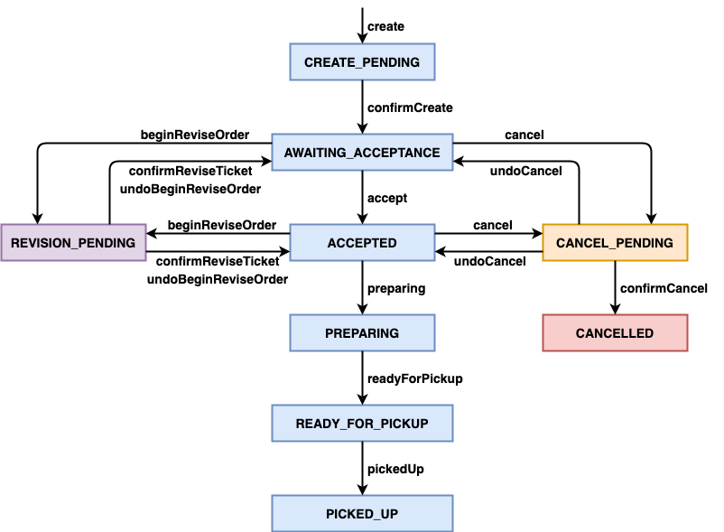

# Kitchen Service

- [**Business Logic**](#business-logic)
- [**APIs**](#apis)
   - [RESTful APIs](#restful-apis)
   - [gRPC APIs](#grpc-apis)
- [**Commands**](#commands)
   - [Outbound Commands](#outbound-commands)
   - [Inbound Commands](#inbound-commands)
- [**Events**](#events)
   - [Outbound Events](#outbound-events)
   - [Inbound Events](#inbound-events)
- [**Database**](#database)

## Business Logic
### Ticket Workflow

| State | Description |
|----|----|
| **CREATE_PENDING** | A new ticket has been created locally. Wait for other services finish their corresponding operations for creating a ticket. |
| **AWAITING_ACCEPTANCE** | The creation of the new ticket has been confirmed. Wait for the ticket be accepted. |
| **ACCEPTED** | The kitchen has accepted the ticket of the order. |
| **PREPARING** | The kitchen is preparing the food of the ticket. |
| **READY_FOR_PICKUP** | The kitchen has finished preparing the food of the ticket. The food is ready for pickup. |
| **PICKED_UP** | The food of the ticket has been picked up. |
| **CANCEL_PENDING** | The ticket start to be cancelled. Wait for other services finish their corresponding operations for cancelling the ticket. |
| **CANCELLED** | The ticket has been cancelled. |
| **REVISION_PENDING** | The ticket start to be revised. Wait for other services finish their corresponding operations for revising the ticket.  |

## APIs
### RESTful APIs
[API Documentation (Swagger UI)](http://localhost:8084/swagger-ui.html)
| Method | URL | Request | Response | Description | 
|----|----|----|----|----|
| GET | `/restaurants/{restaurantId}` | | `GetRestaurantResponse` JSON | Get a restaurant by restaurant ID. |
| POST | `/tickets/{ticketId}/accept` | `TicketAcceptance` JSON | | Accept a ticket by ticket ID. |

### gRPC APIs
**None**

## Commands
### Outbound Commands
**None**

### Inbound Commands
- Inbound command channel name: `kitchenService`

| Command | Description |
|-----|----|
| CreateTicketCommand | |
| ConfirmCreateTicketCommand | |
| CancelCreateTicketCommand | |
| BeginCancelTicketCommand | |
| ConfirmCancelTicketCommand | |
| UndoBeginCancelTicketCommand | |
| BeginReviseTicketCommand | |
| UndoBeginReviseTicketCommand | |
| ConfirmReviseTicketCommand | |

## Events
### Outbound Events
- Core event entity (Aggregate root entity): Ticket 

| Event | Target Service(s) | Description |
|----|----|----|
| TicketCreatedEvent | None | <li>The Kitchen Service notifies other services about a ticket has been created. |
| TicketAcceptedEvent | None | <li>The Kitchen Service notifies other services about a ticket has been accepted. |
| TicketPreparationStartedEvent | None | <li>The Kitchen Service notifies other services about the food preparation has been started for a ticket. |
| TicketPreparationCompletedEvent | None | <li>The Kitchen Service notifies other services about the food preparation is completed for a ticket. |
| TicketPickedUpEvent | None | <li>The Kitchen Service notifies other services about the food has been picked up for a ticket. |
| TicketCancelledEvent | None | <li>The Kitchen Service notifies other services about a ticket has been cancelled. |
| TicketRevisedEvent | None | <li>The Kitchen Service notifies other services about a ticket has been revised. |

### Inbound Events

| Source Service | Event | Description |
|----|----|----|
| Restaurant Service | RestaurantCreatedEvent | <li>The Restaurant Service notifies other services about a new restaurant record has been created. <li>The Order Service will create a same new restaurant record in its database correspondingly.  |
| Restaurant Service | RestaurantMenuRevisedEvent | <li>The Restaurant Service notifies other services about a new restaurant's menu has been revised. (*NOT IMPLEMENTED*) <li>The Order Service will revise the same restaurant's menu in its database correspondingly. (*NOT IMPLEMENTED*) |

### Database
- **tickets**
  | **Column** | **Type** | **Properties** |
  |----|----|----|
  | id |  bigint(20) | PRI |
  | accept_time | datetime | |
  | picked_up_time | datetime | |
  | preparing_time | datetime | |
  | previous_state | int(11) | |
  | ready_by | datetime | |
  | ready_for_pickup_time | datetime | |
  | restaurant_id | bigint(20) | |
  | state | varchar(255) | |

- **ticket_line_items**
  | **Column** | **Type** | **Properties** |
  |----|----|----|
  | ticket_id | bigint(20) | MUL |
  | menu_item_id | varchar(255) | |
  | name | varchar(255) | |
  | quantity | int(11) | |

- **kitchen_service_restaurants**
  | **Column** | **Type** | **Properties** |
  |----|----|----|
  | id | bigint(20) | PRI |

- **kitchen_service_restaurant_menu_items**
  | **Column** | **Type** | **Properties** |
  |----|----|----|
  | restaurant_id | bigint(20) | MUL |
  | id | varchar(255) | |
  | name | varchar(255)| |
  | amount | decimal(19,2) | |
