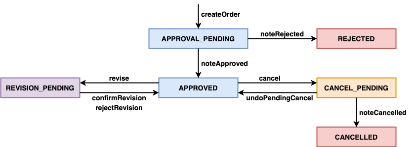

# Order Service

- [**Business Logic**](#business-logic)
- [**APIs**](#apis)
   - [RESTful APIs](#restful-apis)
   - [gRPC APIs](#grpc-apis)
- [**Commands**](#commands)
   - [Outbound Commands](#outbound-commands)
   - [Inbound Commands](#inbound-commands)
- [**Events**](#events)
   - [Outbound Events](#outbound-events)
   - [Inbound Events](#inbound-events)
- [**Database**](#database)

## Business Logic
### Sagas (Chain Operations)
- **Create order**
  | Step No. | Service | Command | Compensation Command (for rollback) | Description |
  |----|----|----|----|----|
  | 1 | Order Service | | RejectOrderCommand | |
  | 2 | Consumer Service | ValidateOrderByConsumerCommand | | Ask the Consumer Service to validate the consumer of this order.<ul><li>Check the consumer is existing in the Consumer Service or not.<li>Validate total amount of this order (*NOT IMPLEMENTED*)</ul> | 
  | 3 | Kitchen Service | CreateTicketCommand | CancelCreateTicketCommand | Ask the Kitchen Service to create a new ticket of this order.<ul><li>The ticket ID will use the order ID.<li>The state of the ticket will be `CREATE_PENDING`</ul> |
  | 4 | Accounting Service | AuthorizeCommand | | Ask the Accounting Service to authorize the account of the consumer. |
  | 5 | Kitchen Service | ConfirmCreateTicketCommand | | Ask the Kitchen Service to confirm the ticket has been created for this order.<ul><li>Check the ticket is existing in the Kitchen Service or not.<li>Change the state of the ticket from `CREATE_PENDING` to `AWAITING_ACCEPTANCE`</ul> |
  | 6 | Order Service | ApproveOrderCommand | | Ask the Order Service to approve this order.<ul><li>Change the state of the order from `APPROVAL_PENDING` to `APPROVED`.</ul> |
  
- **Cancel order**
  | Step No. | Service | Command | Compensation Command (for rollback) | Description |
  |----|----|----|----|----|
  | 1 | Order Service | BeginCancelCommand | UndoBeginCancelCommand | Ask the Order Service to start cancelling this Order.<ul><li>Change the state of the order to `CANCEL_PENDING`.</ul> |
  | 2 | Kitchen Service | BeginCancelTicketCommand | UndoBeginCancelTicketCommand | Ask the Kitchen Service to start cancelling the ticket of this order.<ul><li>Change the state of the ticket to `CANCEL_PENDING`.</ul> |
  | 3 | Accounting Service | ReverseAuthorizationCommand | | Ask the Accounting Service to reverse the authorization of the account of the consumer. |
  | 4 | Kitchen Service | ConfirmCancelTicketCommand | | Ask the Kitchen Service to confirm the ticket has been cancelled for this order.<ul><li>Change the state of the ticket from `CANCEL_PENDING` to `CANCELLED`.</ul> |
  | 5 | Order Service | ConfirmCancelOrderCommand | | Ask the Order Service to confirm the order has been cancelled<ul><li>Change the state of the order from `CANCEL_PENDING` to `CANCELLED`.</ul> |

- **Revise order**
  | Step No. | Service | Command | Compensation Command (for rollback) | Description |
  |----|----|----|----|----|
  | 1 | Order Service | BeginReviseOrderCommand | UndoBeginReviseOrderCommand | Ask the Order Service to start revising this Order.<ul><li>Change the state of the order to `REVISION_PENDING`.</ul> |
  | 2 | Kitchen Service | BeginReviseTicketCommand | UndoBeginReviseTicketCommand | Ask the Kitchen Service to start revising the ticket of this order.<ul><li>Change the state of the ticket to `REVISION_PENDING`.</ul> |
  | 3 | Accounting Service | ReviseAuthorizationCommand | | Ask the Accounting Service to revise the authorization of the account of the consumer. |
  | 4 | Kitchen Service | ConfirmReviseTicketCommand | | Ask the Kitchen Service to confirm the ticket has been revised for this order.<ul><li>Change the state of the ticket from `REVISION_PENDING` to the previous state before revising.</ul> |
  | 5 | Order Service | ConfirmReviseOrderCommand | | Ask the Order Service to confirm the order has been revised<ul><li>Change the state of the order from `REVISION_PENDING` to the previous state before revising.</ul> |

### Order Workflow

| State | Description |
|----|----|
| **APPROVAL_PENDING** | A new order has been created locally. Wait for other services finish their corresponding operations for creating a order, like the consumer’s credit card will be authorized. |
| **APPROVED** | The order has been approved. The consumer’s credit card has been authorized. |
| **REJECTED** | The order has been rejected. One of the services rejected the order or authorization failed. |
| **CANCEL_PENDING** | The order start to be cancelled. Wait for other services finish their corresponding operations for cancelling the order. |
| **CANCELLED** | The order has been cancelled. |
| **REVISION_PENDING** | The order start to be revised. Wait for other services finish their corresponding operations for revising the order. |

## APIs
### RESTful APIs
[API Documentation (Swagger UI)](http://localhost:8086/swagger-ui.html)
| Method | URL | Request | Response | Description | 
|----|----|----|----|----|
| POST | `/orders` | `CreateOrderRequest` JSON | `CreateOrderResponse` JSON | Add a new order. |
| GET | `/orders/{orderId}` | | `GetOrderResponse` JSON | Get an order by order ID. |
| POST | `/orders/{orderId}/cancel` | | `GetOrderResponse` JSON | Cancel an order by order ID. |
| POST | `/orders/{orderId}/revise` | `ReviseOrderRequest` JSON | `GetOrderResponse` JSON | Revise an order by order ID. |
| GET | `/restaurants/{restaurantId}` | | `GetRestaurantResponse` JSON | Get a restaurant by restaurant ID. |

### gRPC APIs
| Method | Request | Response | Description |
|----|----|----|----|
| createOrder | `CreateOrderRequest` Object | `CreateOrderReply` Object | Add a new order. |
| cancelOrder | `CancelOrderRequest` Object | `CancelOrderReply` Object | Cancel an order by order ID. |
| reviseOrder | `ReviseOrderRequest` Object | `ReviseOrderReply` Object | Revise an order by order ID. |

## Commands
### Outbound Commands

| Target Service | Command | Saga | Description |
|----|----|----|----|
| Accounting Service | AuthorizeCommand | Create order | |
| Accounting Service | ReverseAuthorizationCommand | Cancel order | |
| Accounting Service | ReviseAuthorizationCommand | Revise order | |
| Consumer Service | ValidateOrderByConsumerCommand | Create order | |
| Kitchen Service | CreateTicketCommand | Create order | |
| Kitchen Service | ConfirmCreateTicketCommand | Create order | |
| Kitchen Service | CancelCreateTicketCommand | Create order | |
| Kitchen Service | BeginCancelTicketCommand | Cancel order | |
| Kitchen Service | UndoBeginCancelTicketCommand | Cancel order | |
| Kitchen Service | ConfirmCancelTicketCommand | Cancel order | |
| Kitchen Service | BeginReviseTicketCommand | Revise order | |
| Kitchen Service | UndoBeginReviseTicketCommand | Revise order | |
| Kitchen Service | ConfirmReviseTicketCommand | Revise order | |
| Order Service | RejectOrderCommand | Create order | |
| Order Service | ApproveOrderCommand | Create order | |
| Order Service | BeginCancelCommand | Cancel order | |
| Order Service | UndoBeginCancelCommand | Cancel order | |
| Order Service | ConfirmCancelOrderCommand | Cancel order | |
| Order Service | BeginReviseOrderCommand | Revise order | |
| Order Service | UndoBeginReviseOrderCommand | Revise order | |
| Order Service | ConfirmReviseOrderCommand | Revise order | |

### Inbound Commands
- Inbound command channel name: `orderService`

| Command | Description |
|-----|----|
| ApproveOrderCommand | |
| RejectOrderCommand | |
| BeginCancelCommand | |
| UndoBeginCancelCommand | |
| ConfirmCancelOrderCommand | |
| BeginReviseOrderCommand | |
| UndoBeginReviseOrderCommand | |
| ConfirmReviseOrderCommand | |

## Events
### Outbound Events
- Core event entity (Aggregate root entity): Order 

| Event | Target Service(s) | Description |
|----|----|----|
| OrderAuthorizedEvent | | |
| OrderCancelledEvent | | |
| OrderRejectedEvent | | |
| OrderRevisedEvent | | |
| OrderRevisionProposedEvent | | | 

### Inbound Events

| Source Service | Event | Description |
|----|----|----|
| Restaurant Service | RestaurantCreatedEvent | <li>The Restaurant Service notifies other services about a new restaurant record has been created. <li>The Order Service will create a same new restaurant record in its database correspondingly.  |
| Restaurant Service | RestaurantMenuRevisedEvent | <li>The Restaurant Service notifies other services about a new restaurant's menu has been revised. (*NOT IMPLEMENTED*) <li>The Order Service will revise the same restaurant's menu in its database correspondingly. (*NOT IMPLEMENTED*) |

### Database
- **order**
  | **Column** | **Type**| **Properties** |
  |----|----|----|
  | id | bigint(20) | PRI | 
  | consumer_id | bigint(20) |
  | city | varchar(255) | |
  | delivery_state | varchar(255) | |
  | street1 | varchar(255) | |
  | street2 | varchar(255) | |
  | zip | varchar(255) | |
  | delivery_time | datetime | |
  | amount | decimal(19,2) | |
  | payment_token | varchar(255) | |
  | restaurant_id | bigint(20) | |
  | state | varchar(255) | | 
  | version | bigint(20) | | 

- **order_line_items**
  | **Column** | **Type**| **Properties** |
  |----|----|----|
  | order_id | bigint(20) | MUL |
  | menu_item_id | varchar(255) | |
  | name | varchar(255) | 
  | price | decimal(19,2) | | 
  | quantity | int(11) | |
